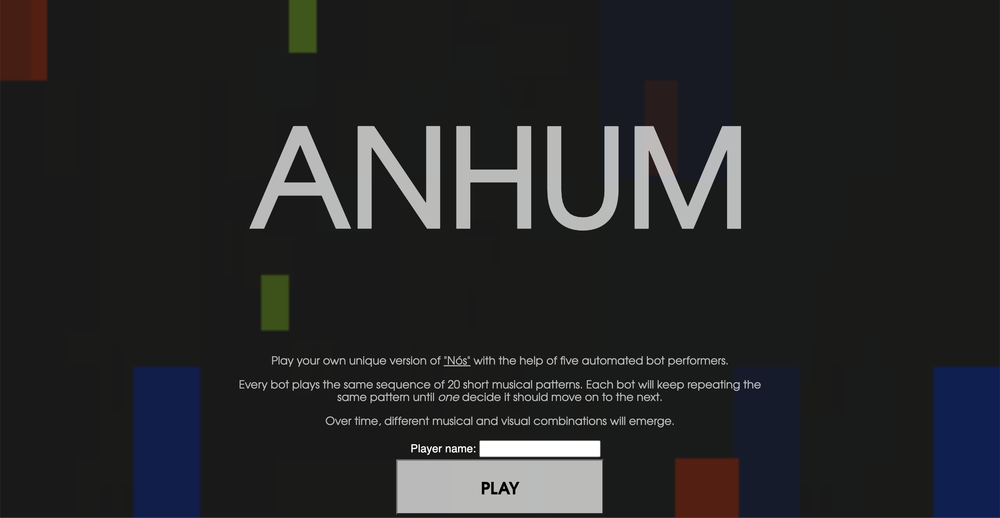
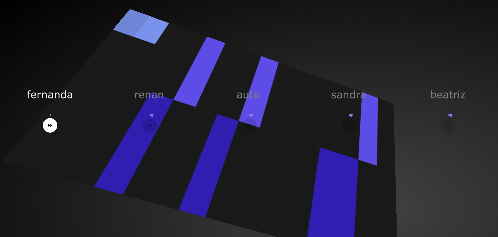

# ANHUM WEB

Dos deuses indígenas brasileiros, era ele que avisava que as entidades sagradas estavam chegando através do Sacro Taré, um instrumento criado pelos deuses e que emitia um som nunca antes escutado no mundo.

Diz o mito que no início dos tempos, as festas não eram celebradas com batuques e as pessoas não cantavam, pois não existiam instrumentos e nem a combinação mágica das notas musicais.

Até que um dia, o neto de Tupã, Anhum, desceu e veio passear às margens do rio Araguaia com sua noiva e notou um silêncio mortal, ao entardecer. Isso o deixou muito triste. Para trazer mais alegria aos povos indígenas, Anhum convocou deuses, semi-deuses e homens para criar a música.

O deus da melodia deu nome às sete notas musicais e foi o semideus Saci-Pererê que as pintou de preto em um pedaço de madeira, segundo a mitologia tupi-guarani. Tupã ficou tão satisfeito com o resultado que abençoou a música e a tornou divina.

Este projeto é um _fork_ do repositório ["in-c"](https://github.com/teropa/in-c)
desenvolvido por [Tero Parviainen](https://github.com/teropa) que permite um usuário compor uma peça
inteira baseado em uma ordem predefinida de fragmentos sendo tocados por 5 _bots_.

Esta interface _web_ prtende conectar o usuário à plataforma que permitirá a composição de uma peça
original intitulada ``Nós''. Também pretende que os outros bots sejam controlados por outros usuários
que utilizem a plataforma.

As principais atualizações deste projeto são:

- adição de 5 novos instrumentos ao _ensemble_;
- um _score_ de 20 fragmentos que compõem a peça ``Nós'';
- a habilidade de se conectar com um nome de usuário único;
- capacidade de cada usuário conectado de controlar o seu instrumento;

## Screenshots

